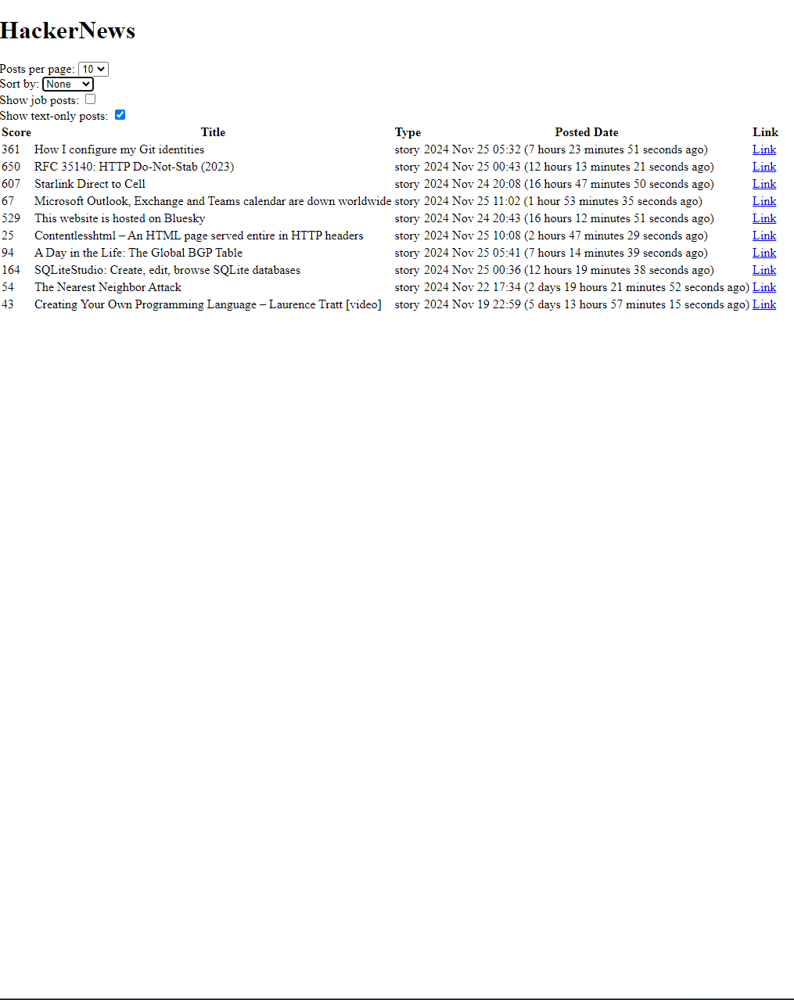
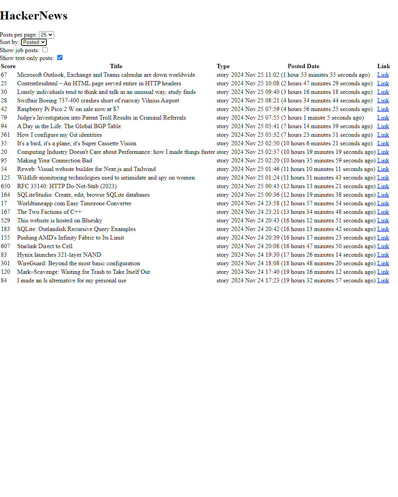

# Elm Hacker News Client

This project is a web application built using **Elm**, a functional programming language designed for creating reliable and maintainable web applications.

## About the Project

The goal of this application is to provide a user-friendly interface for browsing and interacting with posts from Hacker News. 
It demonstrates how Elm simplifies state management and handles features like filtering and sorting.

### Key Features

- **Post Listing:**  
  Displays a list of posts with details such as title, author, score, date, and a link to the original source. 
- **Filtering and Sorting:**  
  Posts can be filtered and sorted based on score, recency, or title.
- **Elm Architecture:**  
  Built using Elm's model-update-view architecture.

### Examples

#### Before Filtering:

#### After Filtering:

---

This project highlights the power of Elm for building clean, performant, and maintainable web applications. 
It serves as a practical example for exploring functional programming in the context of web development.
